**Name:** Shagun saini 
**SAP ID:** 500119652
**Batch:** B3 (CCVT)

# Lab – Experiment 1

## Objective
- To understand the conceptual and practical differences between Virtual Machines and Containers.
- To install and configure a Virtual Machine using VirtualBox and Vagrant on Windows.
- To install and configure Containers using Docker inside WSL.
- To deploy an Ubuntu-based Nginx web server in both environments.
- To compare resource utilization, performance, and operational characteristics of VMs and Containers.

---
## Software and Hardware Requirements
### Hardware
- 64-bit system with virtualization support enabled in BIOS
- Minimum 8 GB RAM (4 GB minimum acceptable)
- Internet connection

### Software (Windows Host)
- Oracle VirtualBox
- Vagrant
- Windows Subsystem for Linux (WSL 2)
- Ubuntu (WSL distribution)
- Docker Engine (docker.io)

### Software (macOS – for troubleshooting/reference)
- Oracle VirtualBox (Intel Macs only)
- Vagrant
- Docker Desktop (alternative if WSL is not applicable)

---
## Theory
### Virtual Machine (VM)
A Virtual Machine emulates a complete physical computer, including its own operating system kernel, hardware drivers, and user space. Each VM runs on top of a hypervisor.

**Characteristics:**
- Full OS per VM
- Higher resource usage
- Strong isolation
- Slower startup time

### Container
Containers virtualize at the operating system level. They share the host OS kernel while isolating applications and dependencies in user space.

**Characteristics:**
- Shared kernel
- Lightweight
- Fast startup
- Efficient resource usage

---

## Experiment Setup – Part A: Virtual Machine (Windows)


### Step 1: Install VirtualBox
1. **Download VirtualBox** from the official website.
2. **Run the installer** and keep default options.
3. **Restart the system** if prompted.

### Step 2: Install Vagrant
1. **Download Vagrant** for Windows.
2. **Install** using default settings.
3. **Verify installation:**
	```bash
	vagrant --version
	```
	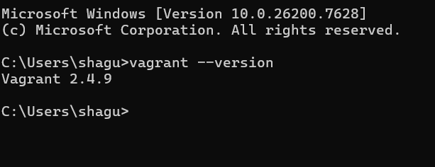

**Step 3: Create Ubuntu VM using Vagrant**
Create a new directory and initialize Vagrant:
```bash
mkdir vm-lab
cd vm-lab
vagrant init ubuntu/jammy64
```
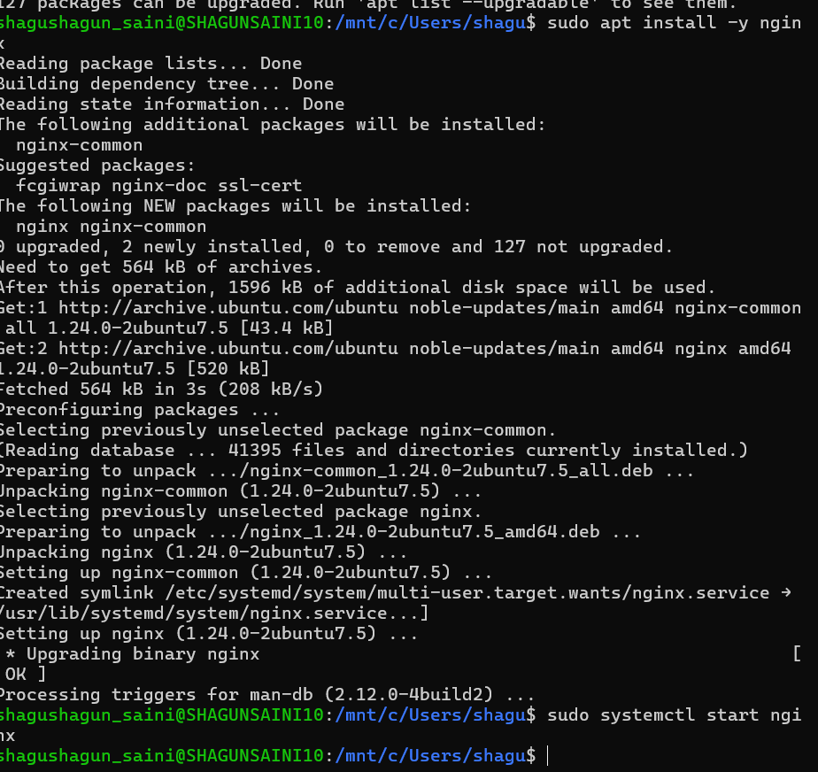

Start the VM:
```bash
vagrant up
```


Access the VM:
```bash
vagrant ssh
```
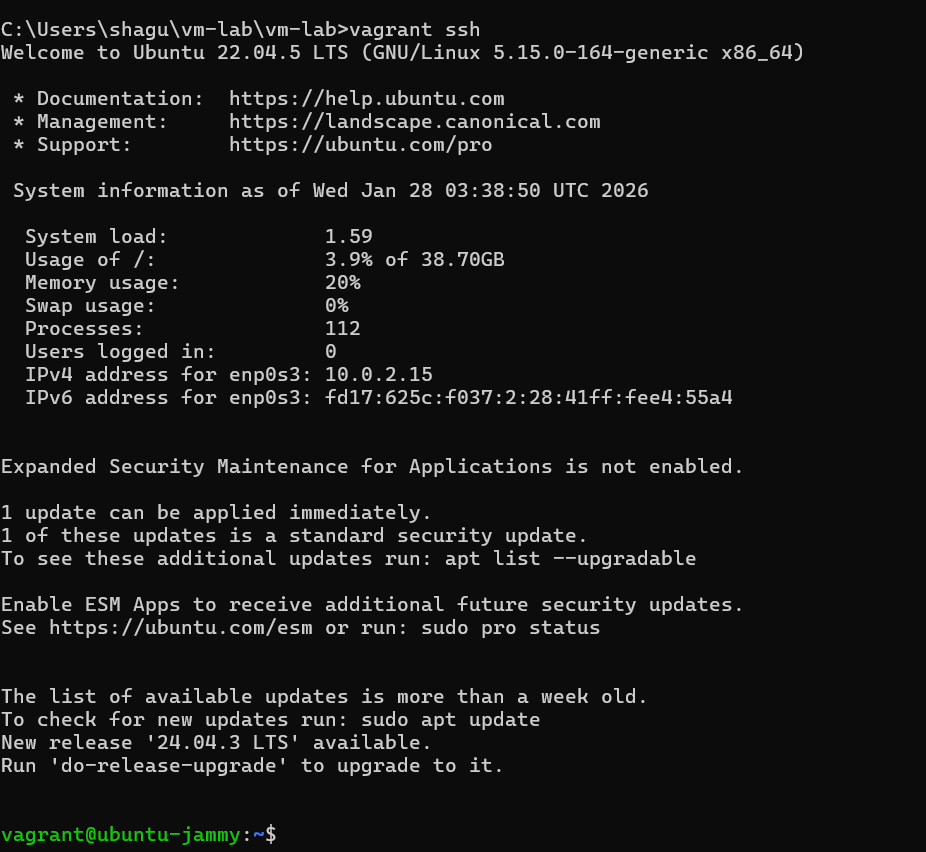

**Step 4: Install Nginx inside VM**
```bash
sudo apt update
sudo apt install -y nginx
sudo systemctl start nginx
```
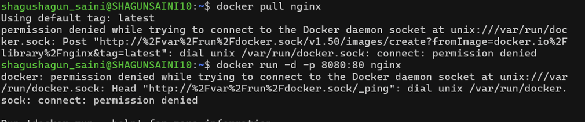

**Step 5: Verify Nginx**
```bash
curl localhost
```
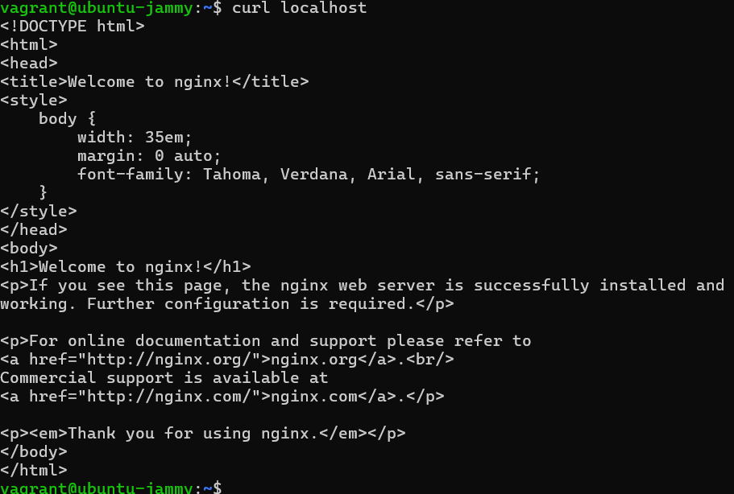

**Stop and remove VM**
```bash
vagrant halt
```

```bash
vagrant destroy
```


---
## Experiment Setup – Part B: Containers using WSL (Windows)


**Step 1: Install WSL 2**
```bash
wsl --install
```
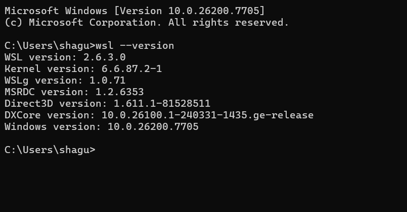

**Step 2: Install Ubuntu on WSL**
```bash
wsl --install -d Ubuntu
```
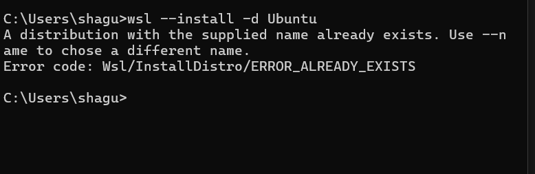

**Step 3: Install Docker Engine inside WSL**
```bash
sudo apt update
sudo apt install -y docker.io
sudo systemctl start docker
sudo usermod -aG docker $USER
# Logout and login again to apply group changes
```
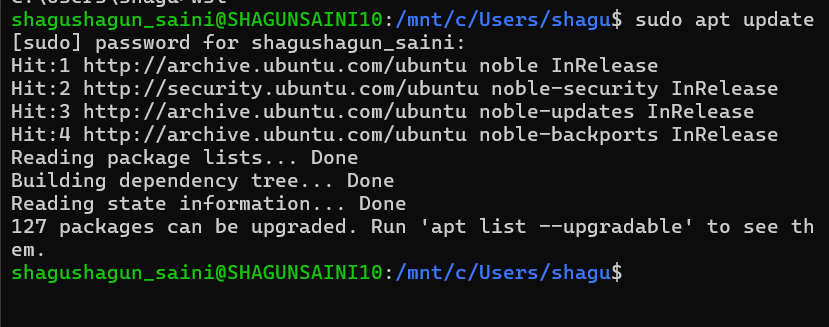

**Step 4: Run Ubuntu Container with Nginx**
```bash
docker pull ubuntu
```
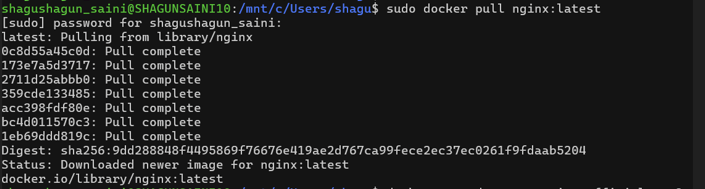
```bash
docker run -d -p 8080:80 --name nginx-container nginx
```


**Step 5: Verify Nginx in Container**
```bash
curl localhost:8080
```


---
## Resource Utilization Observation


### VM Observation Commands
```bash
free -h
htop
systemd-analyze
```
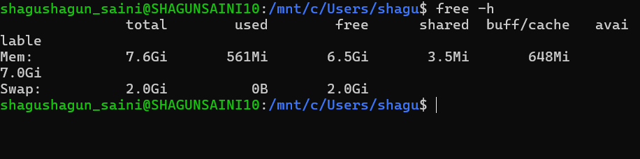

### Container Observation Commands
```bash
docker stats
```

```bash
free -h
```
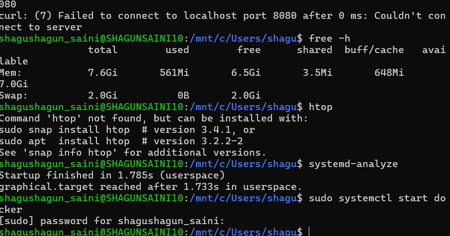

| Parameter      | Virtual Machine | Container |
|---------------|----------------|-----------|
| Boot Time     | High           | Very Low  |
| RAM Usage     | High           | Low       |
| CPU Overhead  | Higher         | Minimal   |
| Disk Usage    | Larger         | Smaller   |
| Isolation     | Strong         | Moderate  |

---
## Result
The experiment demonstrates that containers are significantly more lightweight and resource-efficient compared to virtual machines, while virtual machines provide stronger isolation and full OS-level abstraction.
---
## Conclusion
Virtual Machines are suitable for full OS isolation and legacy workloads, whereas Containers are ideal for microservices, rapid deployment, and efficient resource utilization.
---

---
## References
- VirtualBox Documentation
- Vagrant Documentation
- Docker Official Documentation
